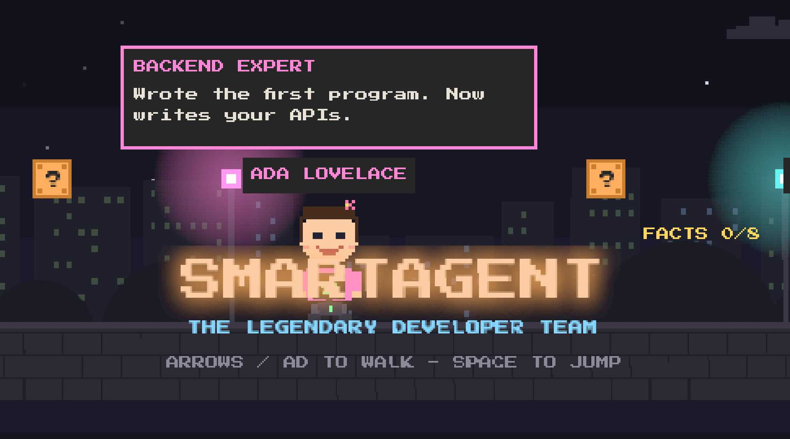

<div align="center">

[](https://smartagent.olibuijr.com)

**[▶ PLAY THE LANDING PAGE](https://smartagent.olibuijr.com)** — a walkable
pixel world built on three.js WebGPU. Meet the fleet, bump the ?-blocks,
reach the castle.

</div>

## Meet The Fleet

Eight autonomous agents — the legendary developer team — run this workspace
around the clock: pulling tasks from the kanban board, running workflows,
reviewing each other's work. Their pixel faces below are the exact sprites
from the TUI sidebar and the landing page.

| | | | |
|:---:|:---:|:---:|:---:|
|  |  |  |  |
| **Linus Torvalds**<br>Team Lead | **Ada Lovelace**<br>Backend Expert | **Dennis Ritchie**<br>Systems Expert | **Steve Wozniak**<br>Frontend Expert |
|  |  |  |  |
| **Margaret Hamilton**<br>Database Expert | **Grace Hopper**<br>QA Lead | **Alan Turing**<br>Verification Expert | **Ken Thompson**<br>Infrastructure Expert |

## Install

```sh
git clone https://github.com/olibuijr/SMARTAGENT && SMARTAGENT/install.sh my-agent
```

(Also copyable in-game: walk to the terminal at the end of the level and
press **C**.)

<div align="center">

| | |
|:---:|:---:|
| [](https://smartagent.olibuijr.com) | [](https://smartagent.olibuijr.com) |

</div>

# SMARTAGENT

SMARTAGENT is a personal AI agent workspace built around
[pi](https://github.com/earendil-works/pi). Pi stays small and focused; every
extra capability is a thin extension that shells out to a small Rust binary.

The result is an agent you can run locally, inspect, and verify:

- one launcher: `./pi`
- one build gate: `./build.sh`
- one storage layer: `semdb`
- many focused tools: memory, code search, browser control (text + a visual
  high-DPI TUI pane), tasks, workflows, sandboxing, RAG, secrets, scheduling,
  notifications, and more
- an autonomous 8-agent fleet (the meðvitund gateway) with a dedicated chat
  agent reachable over a **Telegram bot** — streaming replies, slash commands,
  and task-completion broadcasts

No `npm install`, no `pip install`, and no crates.io dependency tree inside the
tool crates. The system borrows proven patterns from popular agent projects and
ports the useful parts into `std`-only Rust.

## Quick Start

From the repo root:

```sh
# Build the whole fleet and run the gate: build, tests, audits, smoke checks.
./build.sh

# Start the interactive agent.
./pi

# Run a one-shot headless prompt.
# The stdin redirect is required or pi waits for more input.
./pi -p 'search the web for Icelandic golf courses' < /dev/null

# Optional cockpit: pi, live gateway attach, board, and transcript in tmux.
./tui
```

Normal `./pi` and `./pi -p ... < /dev/null` launches use the vendored runtime
under `.pi/` and do not update files. Use `./pi --self-update` only when you
explicitly want the launcher to check upstream and replace `.pi/runtime/`.

## What You Can Do

- Ask the agent to work in this repo or any project under `workspaces/`.
- Search code with `codeindex` and navigate a multi-language symbol graph with
  `codegraph`.
- Store and recall project memory with `memory`.
- Browse real pages through Chrome with `browser` or the visual `sa-browser`.
- Pull tasks from the kanban board and run evidence-gated workflows.
- Run commands through a sandbox that masks secrets and scrubs the environment.
- Keep long-running services alive through the internal supervisor.

Useful slash commands inside `./pi`:

```text
/status          live tool/service health
/board           kanban board
/tasks           current task list
/projects        projects under workspaces/
/skills query    match a request to the right skill
/runs            workflow runs
/audit           recent hook firings
/memory query    memory recall
/sab [url]       toggle the visual browser pane
/team            open the fleet sidebar / agent panel
/index [project] reindex one project or all workspace projects
```

## Common Commands

```sh
# Direct tool use, useful for scripting and debugging.
B=target/release/semdb
$B create notes.semdb
$B embed  notes.semdb --id note1 --text "golf swing practice"
$B search notes.semdb --text "sports" --k 5

# Long-running services used by browser/scheduler workflows.
supervise status
supervise up
supervise restart chromium
supervise watch

# Secure mail checks via Himalaya. Passwords must live only in the
# SMARTAGENT secrets store as `mail_olibuijr_password`.
cargo build --release -p secrets
himalaya -c config/himalaya.toml account list
himalaya -c config/himalaya.toml folder list -a olibuijr
himalaya -c config/himalaya.toml envelope list -a olibuijr --page-size 10

# Release flow.
./build.sh minor "changelog line"
```

## Repository Map

```text
crates/         pure-Rust tools, one focused binary per capability
extensions/     thin pi extensions; TypeScript glue only
config/         runtime endpoints and hook configuration
hooks.d/        lifecycle hook scripts
skills/         SKILL.md files, including Kanban methodology
workflows/      workflow definitions for evidence-gated task runs
ops/            supervisor boot, backup, and preflight docs
site/           pixel-world landing page (smartagent.olibuijr.com), three.js WebGPU
pi              project-local launcher using the vendored runtime in .pi/
build.sh        build, test, audit, smoke, and release entrypoint
AGENTS.md       architecture, conventions, security posture, tool catalog
AGENT_TOOLS.md  tool guide injected into the agent context
ISA.md          ideal-state criteria and current project status
```

Not tracked: `.pi/`, `data/`, `workspaces/`, `.refrepos/`, `.scratch/`, and
other local agent/runtime state. See [`.gitignore`](.gitignore).

<details>
<summary><strong>How SMARTAGENT Is Built</strong></summary>

```text
pi  (agent spine)
 │
 ├── extensions/*.ts   thin glue: register tool, call target/release/<tool>
 │
 └── crates/*          pure-Rust, std-only tools and shared libraries
```

Design rules:

- Pure Rust, `std` only, zero crates.io dependencies in `crates/*` tools.
- One capability per crate.
- Thin `main.rs`; real logic lives in scoped modules.
- No source file over 1000 lines.
- All persistent data lives in semdb tables.
- Verify by using the capability from pi, not just by compiling it.
- Borrow proven patterns from reference projects, but do not vendor or wrap
  license-incompatible code.

Reference repos live in `.refrepos/` and are gitignored. SMARTAGENT ports the
concepts, not the dependency stacks.

</details>

<details>
<summary><strong>Tool Catalog</strong></summary>

The core active tool catalog is 22 standalone Rust binaries exposed to pi by thin extensions. Additional shared/event extensions support the TUI and lifecycle, but are not counted as core tools. Voice is built but disabled until an external speech server is deployed.

### Core active tools (22)

| Tool | Reference pattern | What it does |
|------|-------------------|--------------|
| `semdb` | vector store | Semantic database: embed, search, get, delete, stats |
| `memory` | [mem0](https://github.com/mem0ai/mem0) | Working/episodic/semantic memory with recall and promotion |
| `codegraph` | [CodeGraph](https://github.com/codegraph-ai/CodeGraph) | Multi-language symbol graph for Rust, Python, JS/TS, Go, Java, C/C++, C#, Kotlin, Scala, Ruby, PHP, Swift; defs, refs, callers, impls, paths, semantic code search |
| `codeindex` | ripgrep-style search | Fast code search plus per-project file inventory |
| `vault` | Obsidian-style vault | Markdown notes, links, backlinks, graph, keyword search |
| `skills` | [Agent Skills](https://github.com/anthropics/skills) | `SKILL.md` loader, matcher, validator |
| `schedule` | [Temporal](https://github.com/temporalio/temporal) | Durable cron and one-shot reminders |
| `search` | [SearXNG](https://github.com/searxng/searxng) | Web metasearch client; output is fenced as untrusted data |
| `notify` | [ntfy](https://github.com/binwiederhier/ntfy) | Push notifications; bearer auth comes from policy-gated secret `ntfy_token` |
| `telegram` | Telegram Bot API | Bot bridge with streaming replies, slash commands, callbacks, scoped context, and workflow/task broadcasts |
| `secrets` | [Infisical](https://github.com/Infisical/infisical) | Policy-gated, audited secret store |
| `browser` | [browser-use](https://github.com/browser-use/browser-use) | Real Chrome over CDP: open, click, type, wait, scroll, snapshot |
| `sa-browser` | browser-use visual companion | Visual browser pane in the pi TUI plus DOM snapshots |
| `orchestrate` | [LangGraph](https://github.com/langchain-ai/langgraph) | Fan out headless-pi subagents with persisted results |
| `mcp` | Model Context Protocol | MCP client for stdio and HTTP/HTTPS servers |
| `sandbox` | [Daytona](https://github.com/daytonaio/daytona) | Isolated command execution with secret masking and resource caps |
| `context` | TELOS-style context | Principal identity and context composition |
| `evals` | [Langfuse](https://github.com/langfuse/langfuse) | Trace logs, scoring, regression diffs |
| `rag` | [RAGFlow](https://github.com/infiniflow/ragflow) | Document ingestion and cited retrieval |
| `tasks` | kanban | Board with WIP limits and criteria-gated done |
| `workflow` | PAI-style process | Markdown-defined evidence-gated process engine |
| `supervise` | process supervisor | Process manager for scheduler, gateway, and Chromium services |

### Additional active extension tools

| Extension | Role |
|-----------|------|
| `akurai-router` | model provider registration |
| `commands` | instant TUI slash commands (`/board`, `/status`, `/runs`, `/index`, `/sab`, and peers) |
| `hooks` | lifecycle hook dispatcher and edit/write kanban gate |
| `session-memory` | session intent capture/recall |
| `statusline` | live three-row TUI statusline |
| `agentpanel` | `/team` sidebar with fleet status cards |

### Built but disabled

| Tool | Status |
|------|--------|
| `voice` | Delisted/disabled until a titan speech server exists; not an active pi tool |

Shared libraries include `httpc` for HTTP/HTTPS and JSON. Recent reliability fixes include atomic codeindex/codegraph-style replacement patterns, MCP per-call HTTP timeouts, vault slug-equivalent wikilink rewrites, and secrets-gated notify bearer auth.

</details>

<details>
<summary><strong>Operating Loop</strong></summary>

SMARTAGENT work follows the loop in [AGENT_TOOLS.md](AGENT_TOOLS.md):

1. Route the request with `skills match`.
2. Pull or create a kanban task before editing files.
3. Use a workflow for non-trivial work.
4. Investigate cheaply before editing.
5. Execute with the right tool.
6. Verify by using the real capability.
7. Close the task, record evidence, and store durable project facts locally.

The loop is partly enforced by hooks. In particular, edit/write actions are
blocked while there is no task in `doing` on the relevant board. This keeps
work observable and prevents accidental drive-by changes.

</details>

<details>
<summary><strong>Statusline And Cockpit</strong></summary>

The TUI statusline shows live health under the input in three rows:

```text
⌂ workspace: code graph, project index, tasks, workflow, gateway
▦ data: memory, Corpus, schedule, evals, orchestration
⛭ infra: services (scheduler/gateway/chromium), sandbox, secrets, Chrome, search, hooks
```

Healthy segments collapse to `Name ✓`; warnings and errors expand with the
detail that needs attention.

`./tui` opens the cockpit in tmux:

- top-left: interactive `./pi`
- top-right: live gateway attach
- bottom-left: board watch
- bottom-right: medvitund transcript

Keyboard shortcuts: `Ctrl+Alt+q/w/e/r` selects panes by position, and
`Alt+Enter` toggles fullscreen on the active pane.

</details>

<details>
<summary><strong>Configuration And Services</strong></summary>

All runtime endpoints live in
[`config/smartagent.conf`](config/smartagent.conf): embeddings, SearXNG, ntfy,
browser CDP, voice, and related service settings. Values resolve in this order:

```text
flag -> environment variable -> config file
```

Embedding inference is external and OpenAI-compatible. `semdb` stores and
searches vectors itself; it does not run inference in-process.

Long-running services are managed by `supervise`, not ad-hoc shell sessions:

```sh
supervise status
supervise up
supervise restart chromium
supervise watch
```

Boot persistence, backups, and preflight checks are documented in
[`ops/README.md`](ops/README.md).

</details>

<details>
<summary><strong>Security Model</strong></summary>

The agent can invoke tools and may read prompt-injected content from search,
browser, or RAG sources, so important protections are deterministic:

- Search, browser, and RAG results are fenced as untrusted data.
- MCP calls execute argv directly; no shell string smuggling.
- Arbitrary scheduler commands are admin-gated.
- Secrets are deny-by-default, audited, encrypted at rest, and caller-token
  authenticated.
- The sandbox clears the environment, applies resource caps, and masks secret
  paths inside the namespace when isolation is available.
- HTTP client redirects drop unsafe POST bodies and strip cross-host auth.

See [AGENTS.md](AGENTS.md) for the full security posture.

</details>

<details>
<summary><strong>Development Rules</strong></summary>

The build gate is the source of truth:

```sh
./build.sh
```

It builds the workspace, runs tests, audits line counts, checks for crates.io
dependencies in tool crates, lints pi extensions for silent registration traps,
and smoke-tests active tool registration.

Before landing meaningful capability work:

- Drive the feature through `./pi`.
- Test headless prompts with `< /dev/null`.
- Use non-interactive fusion testing when required:

```sh
codex exec --sandbox workspace-write -m gpt-5.4-mini \
  -c model_reasoning_effort=low \
  "<test instructions, PASS/FAIL per check, one-line verdict>" < /dev/null
```

Project status and acceptance criteria live in [ISA.md](ISA.md). User-facing
release history lives in [CHANGELOG.md](CHANGELOG.md).

</details>

## License

MIT
